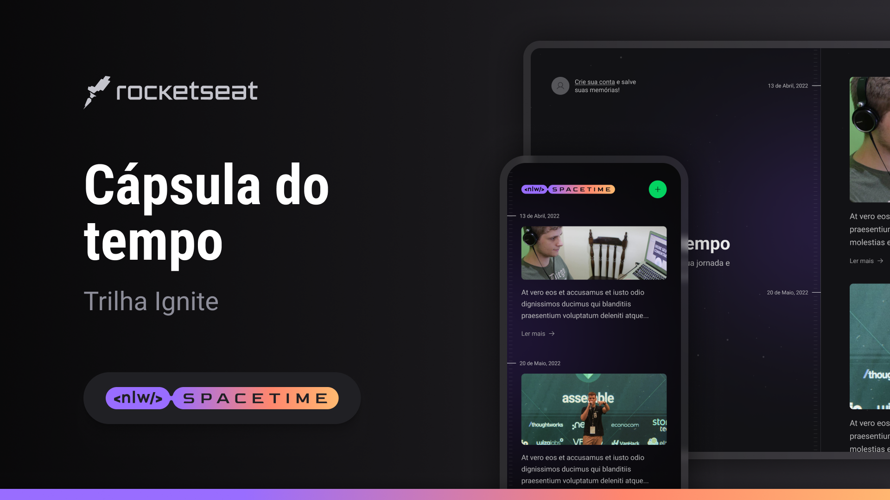
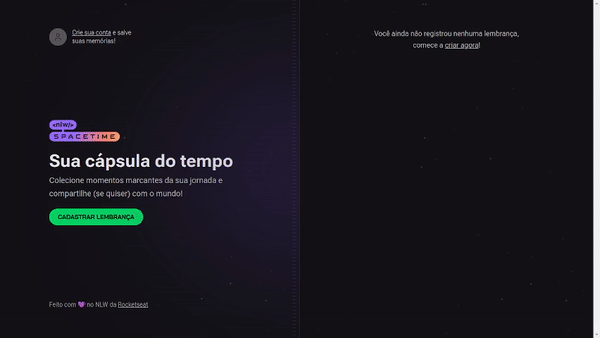
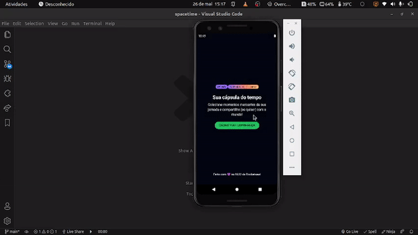

# :rocket: Nlw Spacetime
<div align="center">
    
</div>

---

## :bookmark_tabs: Sobre

- O Nlw Spacetime, foi um evento da [Rocketseat](https://www.rocketseat.com.br/), onde os desenvolvedores criaram o Back-end, Front-end e um App(Mobile), de uma cápsula do tempo, onde disponibilizam as memórias de cada usuário. 
    - Obs: Este Monorepo engloba esses três projetos(Back, Front e Mobile).

---

## :art: Layout

- [Figma](https://www.figma.com/community/file/1240070456276424762)

---
## :camera: Funcionamento

-   ## :earth_africa: Web
<div align="center">
    
</div>

-   ## :iphone: Mobile
<div align="center">
    
</div>

---
## :gear: Techs

- [React Native](https://reactnative.dev/)
- [Expo](https://expo.dev/)
- [React](https://reactjs.org)
- [NextJS](https://nextjs.org/)
- [Tailwind CSS](https://tailwindcss.com/)
- [Prisma](https://www.prisma.io/)
- [Typescript](https://www.typescriptlang.org/)

---

## :desktop_computer: Como usar

<p><strong> 1º</strong> Ao baixar o monorepo, você poderá excutar os seguintes projetos: Backend, Frontend ou Mobile
</p>

<p><strong> 2º</strong> Antes de executar é necessário criar dois OAuth App no Github, seguindo: Settings > Developer Settings > OAuth Apps</p>

<p><strong> 3º</strong> Após criado, copiar o CLIENT_ID e o CLIENT_SECRET de um deles, colocar as variáveis de ambiente no diretório server, em um arquivo .env</p>

```
    GITHUB_CLIENT_ID=
    GITHUB_CLIENT_SECRET=
```
<p><strong> 4º</strong> Para rodar o projeto web, é necessário criar um arquivo .env e colocar a variável de ambiente do CLIENT_ID, na pasta web </p>

```
    NEXT_PUBLIC_GITHUB_CLIENT_ID=
```

<p>Como são dois OAuth Apps, é necessário trocar as variáveis, caso seja Web, usar as credenciais de um OAuth App e no Mobile usar do segundo <p>

<center>
    Frontend e Backend
</center>

```
    yarn dev
```

<center>
    Mobile
</center>

```
    expo start
```

<p><strong> Obs: Para executar o Frontend e o Mobile é necessário o Backend(server) estar rodando para receber as requisições </strong></p>

---

## :books: License

Arquivos sob a licença [MIT](https://github.com/lucasgomesgp) criado por Lucas Gomes.